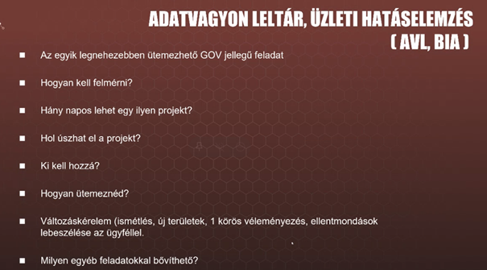

# Week03 Team03 Előadásjegyzetek

**Hétfő 13:00 - Web - Kram György**

A bevezetőben szó volt a waterfall projekt menedzselésről, majd az agilis
módszerről.

A 3. dián a Scrum módszerről beszéltünk.

**Spotify Sqad model**. Hasonlít a Scrum módszerre. Tribeokban vannak az emberek
(keresztfunkcionalitás), azon belül Chapterek (már nem keresztfunkcionális).

A Squadok és a Guildok szintén keresztfunkcionálisak. Minden csapatnek van
rálátása minden problémára.

*A Spotify féle agilis projektmenedzselésben fontos hogy a csapatok cross
funkcionálisak legyenek és minden csapatban megfelelő szintű, minden területhez
hozzászólni tudó tagok kerüljenek.*

**Amennyiben az egyik csapat munkáját egy másiknak kell módosítani:**

Így a két vagy több csapat között egy meeting megszervezését követően az egyes
csapat hozzá adhat funkciókat a kettes csapat kódjához. (magyarázó meeting és
review)

**Hétfő 15:00 - Web - Pimpao Gabriella**

Gabi jelenleg a Codecool-nál termékmenedzser, főként a Journey fejlesztésével
foglalkozik

A Codecool előtt a Transferwise-nál dolgozott és nekünk főleg az ottani
tapasztalatairól mesélt

Egyik projektjük keretében a Transferwise felhasználók ID verification-jét
végezték.

Ezt az tette bonyolulttá, hogy a világ minden tájáról, rengeteg különböző
országból voltak felhasználóik, így rengeteg különböző féle személyazonosító
okmányt kellett ellenőrizniük. A különböző okmányoknak más és más
feltételrendszernek kellett megfelelniük.

78% of IDs verified by 3rd party – A Transferwise azt az elvet követte, hogy
„amihez más jobban ért, azt bízzuk rá és integráljunk velük”, így harmadik
féllel ellenőriztette az okmányok nagyrészét. Így is volt azonban 22% fallout
case, amikről a 3rd party nem tudott dönteni, ezeket belsős kollégákkal
ellenőrizették.

Ki akartak dolgozni egy rendszert, amivel szinte olyan gyorsan el lehet dönteni
egy ID-ről hogy valós e vagy sem, mint egy profil balra vagy jobbra húzása a
Tinderen, ezért a projektnek az ID Tinder project nevet adták. Természetesen
tudták, hogy egy ID ellenőrzés jóval komolyabb dolog, mint a tinderezés, Gabit
zavarta is a projekt neve.

[ arra nem emlékszem pontosan, hogy ebből végülis mennyi valósult meg és hogy
sikerült ]

A Legacy rendszerek megnehezítették dolgukat. Ezek olyan belsős rendszerek,
amelyek hosszú ideje nem voltak fejlesztve, mivel ha fejlesztésről volt szó
akkor érthető okokból inkább azokat a tool-okat fejlesztette a cég, amelyekkel a
felhasználók közvetlenül találkoznak (internal tool requirements user tool
requirements)

Tanulság volt, hogy ne „sufnituningoljanak”, azaz akinek van releváns
tapasztalata egy a projekthez releváns témában azt vonják be, kérjék ki a
véleményét, pl ne akarjanak a US designerek fejleszteni vagy a fejlesztők
design-t tervezni, még akkor se, ha azt hiszik, hogy értenek hozzá.

[ felírtam még, hogy „Buffers needed” és, hogy „change management”, de már nem
jut eszembe pontosan mi kapcsán, meg hogy mit értett Gabi buffer alatt ]

Junioroknak kellett döntést hozniuk, mert organikusan szaporodtak az adatok
ahogy nőtt a cég is.

Nincs 2 ugyanolyan probléma, nincs 2 ugyanolyan megoldás.

Intuícióra szükség van a manager részéről a döntéshozataloknál.

Product Manager kvázi megegyezik a Product Ownerrel

Fontos a manager részéről, hogy legyen domain tudás, ismerje a terméket, meg
tudja határozni az irányt amerre haladni fognak. Gabi napokat töltött el olyan
kollégák mellett, akik az ID ellenőrzést végezték, hogy megtanulja tőlük, hogy a
különböző féle ID-kat mi alapján ellenőrzik.

Sűrűbben kellett volna demokat tartani.

Közös retro-kat és standup-okat tartottak más projektek résztvevőivel, ennek
összezavaró hatása volt, nem volt mindig hatékony.

Kezdetben 2 junior és 1 senior volt a projekten, majd jött még 2 junior meg egy
Engineering Lead aki csak konzultált velük.

**Kedd 13:00 - UI/UX - Pataky Vince**

A folyamat laikus ügyfélnek egy ház építési példával ábrázolható a legjobban.

Olcsóbb hibázni tervezési fázisban!! Fejlesztés közben változtatni fontosabb
dolgokon már nagyon költséges lehet.

A wireframe után új funkciókat beletenni költséges, akár az egész fejlesztés
mehet a kukába emiatt.

Az ügyfelek gyakran meggondolják magukat a terméket illetően, akár design-al
kapcsolatban.

Az ügyfelek sokszor nem értik a magas költségek miértjét, vagy a sok fejlesztési
idő miértjét.

Customer request -\> UI/UX -\> Development.

A folyamat: Éttermi történetként mesélhető el. A data/Content az alapanyag, a UI
a kész étel amit a vendég elé rakunk. A UX pedig az étel elfogyasztása során
keletkezik.

Data/Content -\> UI -\> UX

Régen a UI sokkal bonyolultabb volt, a Usereknek bonyolult programokat kellett
használniuk.

A néhány évvel ezelőtt sokat egyszerűsödött a userek dolga, manapság pedig már
megfordult a tendencia. A Usernek pofonegyszerű dolga van, míg a Fejlesztőnek
nehezebb. (Pl taxirendelés)

Amikor a UI/UX félresiklik:

(felhasználói igények figyelembe vételének mellőzése)

A UI kinézete nagyban befolyásolja a UX-et.

Ha a tervezés tökéletes, de a fejlesztésben sok a hiba, akkor a termék
használhatatlan lesz. Ez a mondat fordítva is igaz.

**Tervezési folyamat:**

Brief: Üzleti terv, megbízás

Kutatás: Piackutatás (nagyvonalakban)

Moodboard: Több demo desing elkészítése melyből az ügyfél választani tud.

Wireframe: Adatbegyűjtés az ügyféltől. (minél több adat kell) Minden tartalom
kerüljön fel a prototipus oldalra. Teljes működés megmutatása az ügyfélnek.

Design: Ez is csak prototípus! Ha a wireframe elfogadott akkor jöhet ez a lépés.
Betűtípus, animációk és minden design elem megmutatása az ügyfélnek.

Fejlesztés: Cél: Az ügyfél itt már ne változtasson, mert az nagyon költséges.
(Ez nem mindig jön össze)

Tesztelés: Bugok feltárása. A kész projekt bemutatása az ügyfélnek.

**Kedd 15:00 - Mobilfejlesztés - Bujdosó Réka Beáta**

Banki applikáció fejlesztéséről mesélt. ---\> Jó volt a dokumentáció, évekre
visszamenőleg is.

Feladat: Be nem jelentkezett felhasználók is tudjanak adatokat beírni.

A szerverváltások miatt lassan ment a fejlesztés. (Sok volt a bug)

A nyelvi nehézség problémákat okozott. Thai nyelvről kellett Angolra fordítani,
vagy vissza.

A projektmenedzser biztosította számukra a nyugodt, kreatív kódolást. Bármilyen
irányból is érkezik impulzus, a projektmenedzser igyekszik ezt kezelni. hogy ne
a fejlesztő ideje menjen el vele.

<https://zeplin.io/> : weboldallal lehet stíluselemeket elemezni minden
platformra, melyeket könnyen másolhatsz. Időspórolás.

<https://www.applanga.com/> : weboldal segítségével lehet oldalakat lefordítani.
(XML lesz belőle és be lehet tenni az appba).

<https://material.io/components> : oldalon emulálva vannak az Android és IOS
felületek sajátosságai. (Gesztusvezérlés főként)

**Lonczkor András előadása: Rendszerüzemeltetés**

Uptime: 2001-ben 1692 nap jó eredmény

2020-ban 120 napnál már elavult a rendszer. (Biztonsági rések lehetnek mert nem
friss az op rendszer.)

>   \- Moduláris rendszerek előnyben

>   \- mikroszervizek előnyben

>   \- Skálázódó architektúrák

>   \- CI/CD óriási előnyt jelent

>   \- Monolith -\> SaaS (System as a Service)

>   **Rendszergazdák típusai:**

>   Közvetlen jövedelem termelő szerepe nincs.

>   \- Kijárós rendszergazda

>   \- Irodai rendszergazda (Az irodai környezet jobbátétele)

>   \- Klasszikus rendszergazda (Szerver üzemeltetés, alkalmazás üzemeltetés)

>   \- Devops (Fejlesztői szemléletű üzemeltető)

>   **Környezet: Linux, Windows, Mac.**

>   Hardver környezet: bare metal (Fizikailag telepített szerver)

>   Virtualizáció: Ha más verziójú programokat használnak akkor crash lehet

>   Konténerizáció: Konténerenkénti projekt, egyben futnak és nincs crash.

>   Felhő: A világ más tájain telepített szerveren fut a projekt. Fizikailag nem
>   elérhető, de teljes hozzáférés van hozzá. (Digitalocean, aws, google cloud,
>   azure)

>   Hybrid felhő: Bizonyos szolgáltatásokat fizikailag tárolnak és úgy
>   futtatják. Később felkerül a felhőbe, de sokkal lassabban töltődik fel. Több
>   szolgáltatótól is vehetünk kapacitást, ha az egyik megáll, a többi átveszi a
>   helyét.

>   Szerver skálázás: A terhelés függvényében változó kapacitást kaphatsz a
>   szerver szolgáltató irányából.

>   **Üzemeltetési Költségek:**

\-mikor milyen költség keletkezik?

Ha a skálázott szerveren megnő a terhelés, akkor annak függvényében nem csak a
rendelkezésre álló kapacitás nő, hanem annak üzemeltetési költsége is.

>   up-front cost: A projekt elején belekerül egy architektúra. (A projekt
>   indulási költsége, technikai oldalról)

>   daily cost: A rendszer/ek fenntartási, üzemeltetési költségei.

>   maintance cost: karbantartási költségek

>   **disaster recovery: Lassú tár, ha gyorsan szeretnél letölteni akkor az
>   nagyon drága. Lassú fel és letöltés ingyenes**

>   opportunity cost: A projekt résztvevője tudna-e mást csinálni, ami több
>   hasznot hoz?

>   **Agency vs Üzemeltetés:**

>   Az Agencyk nem mindig tudják hogy mi az üzemeltetés.

>   Az elkészült projekt nem mindig működik az ügyfélnél, mert nem olyan
>   környezetben van mint fejlesztés közben.

>   Fejlesztési project:

>   \- Architektúra kialakítása a fejlesztőkkel/nek

>   \- bottleneck-ek feltérképezése, megszüntetése

>   \- Skálázhatóság / megfelelő rendszerfelépítés

**Feladatok:**

-   Rendszerüzemeltetés

-   iroda/egyéb környezet

-   Fejlesztői környezet

-   Meglévő és új rendszerek

-   Fejlesztés támogatása

-   Security & Enforcement

**Adatbázis:**

-   Az indexek alapján előszűr az adatbázis, radikális időnyereség is
    lehetséges.

**Load balancer:**

-   Több mögöttes szolgáltatás között balancolja a kéréseket, ezel csökkentve a
    szerver leterheltségét.

-   Több load balancer is létezik. A projekt idulásnál érdemes jól megfontoltan
    választani, mert később kellhet még egy.

**Hibakeresés:**

-   El kell dönteni hogy milyen adatokat kell feltölteni a logokba.

**Marcsó Ferenc előadása: QA – Szoftver tesztelés**

**„A QA a Projektmenedzser legjobb barátja”**

**Hiba és következményei:**

BUG: A hibáknak súlyos gazdasági, biztonsági következményei lehetnek.

**Szoftverhibák okai, típusai:**

Dokumentációs hiba, kódolási hiba, Hardverfeltételek megváltozása, Környezeti

**Miért van szükség tesztelésre?**

Használat során fellépő hibák csökkentése miatt

Minőségi szoftver

Megfeleltetés a szerződésben foglaltaknak

Megfelelés ipari szabványoknak

**Teszteléssel mérjük a szoftver kvalitását**

Megbízhatóság, - 99,99%-ban úgy operál a szoftver, hogy nem jön elő hiba a
használat során.

Használhatóság, - fogyatékossággal élő emberek mennyire tudják használni

Hatékonyság, - Performance teszt

Karbantarthatóság, - Mennyire frissíthető a rendszer

Hordozhatóság – Mennyire tudjuk átvinni a szoftver működését egy másik
platformra

**Mennyi tesztelés szükséges?**

**Mi a szoftvertesztelés?**

Érdemes egyeztetni a csapattal a problémákról és hogy ezekkel a hibákkal együtt
tudunk-e élni vagy sem.

**Szoftvertesztelés definíciója:**

Felhasználhatósági szemszög: Alkalmasság a felhasználó által szánt célra.

Tesztelői szemszög: Egyezés a specifikációval

A szoftverminőség definíciói: Felh szemszög: Alkalmasság a felhasználó által
szánt célra.

Programozói szemszög: Egyezés a specikifációval.

Tulajdonosi szemszög: A minőség attól függ, miért fizet a vevő.

**Tesztelési alapelvek**

>   1. Bugmentes szoftver nincs

>   2. Teljes tesztet csinálni lehetetlen

>   3. Korai tesztelés – Mindél előbb érdemes elkezdeni a tesztelést.

>   4.

5. Féregírtó Paradoxon – Ha az újra tesztelés során mindig ugyanazokat a
teszteseteket futtatjuk, akkor egy idő után már nem találunk hibát.

6.

7.

**Tesztelési Piramis**

>   Unit-\>Integration-\>E2E(Funkcionális)

>   **Interjún érdemes megkérdezni hogy használnak-e egységteszteket?**

**Teszt típusok:**

**Vázlat:**

Mindmap és a közepén PM

\-Szerepek a projektekben

**További diák:**

\-Projektek buktatói

\-PM szerepe a projektben

\-People menedzsment

\-Tanulságok

1.  Google Docs for our notes of each Field story session

2.  Brainstorming on Discord about the mind map, pitfalls & learnings of the
    projects and other contents of our presentation

3.  Google Slides for summarizing our thoughts and formatting them into a
    presentation

WordCloud

Agility Waterfall Product Owner UI/UX DevOps CI/CD

8/5/2020 – 13:00 – Rendszergazda előadás

Üzemeltetés, rendszergazdai feladatok, rendszer tervezés

Változások a rendszergazdák feladatkörében

UPTIME – szerver folyamatos működése

CI/CD – Contigous Integration / Contigous Deployment

System As A Service népszerűsödik

Rendszergazdának közvetlenül **jövedelemteremtő szerepe nincsen**, nehéz mérni
hogy mi a hozzáadott értéke az üzemeltetésnek, nehezen mérhető az eredmény,
nehéz két különböző rendszert kipróbálni és azokat összehasonlítani

Rendszergazda típusok

\- Kijárós rendszergazda

\- Irodai rendszergazda

lehet már mérni

feladat pl: legyen wifi lefedettség, emberek elégedettek legyenek

\- klasszikus rendszergazda (srác az alagsorból)

szerver üzemeltetés

alkalmazás üzemeltetés

\- ezek összegyúrása: DevOps

Fejlesztői szemléletű üzemeltető és üzemeltetői szemléletű fejlesztő elkezd
összedolgozni, hogy összeérjenek, optimálisan működjenek a dolgok

Környezet:

\- szoftver környezetet

\- hardver környezet

15:00 – Tesztelés előadás – QA

**QA csapat nem feltétlen tud jó viszonyt ápolni a fejlesztőkkel, pedig ez
fontos lenne, mert így gördülékenyebbé válik a munka**

**Asszertív jellegű kommunikáció**: ne azt mondd a másik munkájára, hogy szar,
hanem jól építsd fel a kritikát

A hibáknak/bugoknak súlyos gazdasági, emberi életekkel járó következményei
lehetnek

**Tesztelők feladata nem dicsérni, hanem kritizálni a szoftvert**

Szoftvertesztelés a projekt elejétől jelen van (agilis kultúra), hiszen minél
később fedezünk fel egy hibát annál nagyobb költsége van

Kódolási hiba 2 féle lehet:

1. szemantika ellen vétesz hibát: már nyelvet használsz

2. logikai hiba: működésbeli hiba

3 fejlesztőre 1 tesztelő volt eddig az ideális. Sok helyen ez nem fér bele. Itt
jön a **PM-ek szerepe: becslést kell adni, hogy hány tesztelőre lesz szükség**.
Függ attól, hogy mennyire problémás az ügyfél. A bizalom egy költségcsökkentő
dolog. Könnyű ügyfél esetén nem kell annyi időt beleölni az átadás előtt. PM-ek
belecsúsznak business analyst szerepkörbe is.

**Nem az a QA feladata, hogy eldöntse, hogy egy release kimehet vagy sem, a
QA-sek mérőszámokat adnak át a szoftver tesztelésével kapcsolatban, és az üzleti
döntéshozást ezek alapján a projektmenedzser végzi.**

Time Money Quality háromszög: Hogyan tudjunk a legjobb minőséget a legkevesebb
pénzből és legkevesebb idő alatt létrehozni? Ez a projekt menedzsment alapja.
Ezt a háromszöget vesszük figyelembe, nagyon sok tényező befolyásolja.

**Szoftvertesztelés: Tönkre tenni a szoftvert, azaz megtalálni benne a hibákat.
Nem azt kell bebizonyítani, hogy valami jó, hanem azt, hogy valami rossz.**

Szoftvertesztelőknek gonosz kis ördögöknek kell lenniük.

Olyan, hogy hibátlan szoftver nem létezik

Fejlesztő mindig újat akar fejleszteni, kevésbé motivált hibák javítása

A tesztelés egy olyan terület, ami támogatja a menedzsmentet, kimutatja a
hibákat.

A tesztelés nem képes kimondani, hogy nincs hiba, ez lehetetlen.

PM-ként ragaszkodjunk ahhoz, hogy legyenek olyan eszközök, amelyek segítek a QA
csapatot. Eszközök, amelyekben vezetve vannak a követelmények, folyamatok stb.

DATA SCIENCE

Fontos a legalább high-level megértése a technikai dolgoknak

\- kommunikáció miatt

\- domain knowledge és döntéshozatal miatt

\- többiek szeretni fognak

Ott kezdődik egy adatelemzős projekt, hogy van egy üzleti probléma, amit
próbálsz megoldani

0. Collect – gyűlik egy csomó adat, tudunk vele valamit csinálni? – ezzel az a
probléma, hogy kicsit mondvacsinált indok, nincs konkrét üzleti terv mögötte

1. Understand – legyen egy megértésed az üzleti problémáról

2. Mi az az adat amit szükséges gyűjtenem ahhoz, hogy adatvezérelten meg tudjam
válaszolni ezt a kérdést

3. Felfedező/Előzetes adatelemzés: megnézed, hogy pontosan milyen tulajdonságok
állnak rendelkezésre, milyen típusú adatok, mértékegység

4. Clean/Transform: piszkos adat megtisztítása pl mértékegyég rendezés. üres
értékek kezelése, mit jelenthet egy üres érték: nem tudja a választ, nem akarja
megadni, nem volt kötelező megadni, nem mindig triviális hogyan kell kezelni az
üres értéket.

5. Model: hipotézisek, valóság becslése, üzleti kérdés

6. Validation: valóság egyezik-e a modellem szerinti valósággal. modell nem
biztos, hogy releváns más körülmények között. lehet, hogy sok adatom van, de nem
biztos, hogy azok reprezentatívak. Validálás szempontjából érdemes tisztában
lenni azzal, hogy mit csinál a modell, így jobban lehet mérlegelni, hogy a
modell valós-e

Ami hiányzik az ábráról: **Projekt tervezés, erőforrás becslés, ezek PM-ként
nagyon fontosak,** már a projekt elején azt kérdezik tőlünk, hogy ezeket
becsüljük meg. **Tipp: meg kell nézni hogy ez fázisolható-e, betehető-e a
felfedező/előzetes adatelemzés után a tervezés és becslés**

Egy olyan megoldás megbecslése nehéz, ahol még nem látjuk tisztán a problémát.
Olyan kérdésre keressük a választ, ahol nem ismerjük a kérdést.

Understand-be beletartozik, hogy mindenki értse, hogy mit fogunk csinálni, a
megrendelő is. Amíg a kutatási fázis zajlik benne van a pakliban, hogy nem lesz
monetizálható amit találunk. **Olyan irányba kell elvinni a dialógust a
megrendelővel, hogy mi az az összeg, amit még kockáztatna, ameddig még elmenne
azért, hogy kiderüljön h a projektből kihozható e valami.**

Ha datás projekt van az nem annyira egyenes, mint egy más fejlesztési projekt.
Nem egyértelmű, hogy ki lehet-e hozni valamit egy adott adatszettből.

Időbecsléshez tanács: **time-windowing, time-boxing**: menjetek előre egy hetet
és utána döntsétek el merre tovább, ha kell forduljatok vissza, ne
bocsátkozzatok több hónapos idő becslésbe.

Azt ismerjük, hogy egy hét munka mennyibe kerül, célt lehet megfogalmazni. Nem a
lassú és alapos megvalósítás a lényeg mert akkor az első hét után nem tudjuk
megmondani mennyi idő van még hátra. Azt kell mondani, hogy hetekbe/kéthetekbe
megyünk és olyan megoldásra törekszünk, ami ennyi időbe belefér. Megrendelőnek
meg kell értenie, hogy a lépcsők hogyan épülnek egymásra, ne grimaszoljon a
félmegoldásokra.

Azt kell meghatározni mennyi időt vagyunk hajlandók rászánni arra, hogy
eldöntsük, hogy van e tovább.

Fontos, hogy valaki szívügyének érezze a projektet. A PM a felelős, de ha nem
lát rá a projektre kellő szaktudás hiánya miatt akkor nem tudja ténylegesen
vezetni, irányítani azt. Kell valaki, aki szakmailag rendben tartja a projektet,
kiosztja a feladatokat stb.

A tervezést úgy kell facilitálni, hogy az ott lévő emberek magukénak érezzék a
célokat, amihez az kell, hogy a célok az ő ötletükből jöjjenek. Motiváltan kell
tartani a fejlesztőket.

Az kerülendő, hogy legyen olyan feladat, aminek nincsen felelőse.

Bürokráciával számolni kell, csúszások lehetnek, admin dolgok elhúzódhatnak. pl
olyan a környezet h engedély kell ahhoz, hogy a program kilátogasson az
internetre biztonsági okok miatt

Adatelemzésnél sokszor felelőtlenség nem bevonni a jogi osztályt, hogy
egyáltalán megtehetjük e, amit akarunk, vagy a pénzügyi osztályt hogy van e rá
pénzünk. Stakeholderek bevonása fontos tehát.

IoT Előadás 8/6/2020 14:30

Buktatók

\- Tervezhetőség

\- T&M – Time and Material

\- Teszt rendszer hiánya

Az a cél a prototipizálással, hogy tervezési fázisban derüljenek ki a hibák.
Kezdeti terveknek ez a célja

Minél specifikusabb a hardware annál inkább igaz hogy a protokollt a hardver
diktálja.

**Iterációk lényege: ha nem tudod mi az irány, szedd szét lépésekre a projektet
és majd közben meghatározod az irányt**

8/7/2020 13:00 IT Security

Dávid a Kancellária Zrt Governance részlegéről

Információbiztonság

\- üzleti titok: minden, ami nincs kint a honlapon

\- PM Mamut mail-en nem küldhet dokumentumokat!

\- hamis biztonságérzet és veszélyérzet

Keretrendszer, filozófia, gondolkodásmód: IBIR

\- ha az IT alá rendelik a Security-t, az hiba

Projekt vezetésnél, ha tervezésnél beszélni, interjúzni kell más
szakterületekkel (pl a cég pénzügyi vezetője stb) akkor nagyon tökösnek kell
lenni, ha elküldenek ragaszkodni kell hozzá, hogy erre az interjúra szükség van.
Jól kell tudni koordinálni, beleverni az interjúalanyok fejébe, hogy őszintén
beszéljenek. Ütemezni szakaszosan kell, sok mérföldkő behúzásával, azért hogy az
üzleti területeket hozzá lehessen kötni valamihez, core folyamatokat előre
tenni, interjúk ledokumentálása után elkezdeni jóváhagyatni az interjúalanyokkal
a dokumentációt

GDPR óta nem elég csak az információ biztonságért felelős személyt bevonni, az
adat védelemért felelős személyt is be kell vonni, jellemzően jogaszok, külső
jogi tanácsadók (nem olcsók)

a szervezetek folyamatosan változnak, úgy kell ütemezni a projektet, hogy az
aktuális állapotot tükrözze

PM legyen ott CC-ben hogy lássa a kommunikációkat

PM-ek közt verseny megy a projektek ütemezése miatt, fontosabbakat kell előre
venni, érkezik egy megrendelés, az ügyfél az ajánlatunkra vár (hogy mikor tudjuk
megcsinálni), a PM-nek meg ki kell osztania egy tanácsadónak (aki már eleve sok
projekten rajta van) és meg kell mondania mikorra lesz kész vele a tanácsadó. Ez
egy érdekellentét a cégen belül, mert a sales-nek az a célja hogy minél több
projektet adjon el, ügyfelet szerezzen, a tanácsadók meg be vannak táblázva, de
minél gyorsabban kéne dolgozniuk, PM feladata koordinálni, lavírozni a felek
közt

nagyon képbe kell lenni, hogy mire mennyi idő van, a sérülékenységvizsgálatra
érdemes 2-3 hetet rátenni, hibák javítása miatt

**Péntek - Sík Dávid előadása – IT Security**

kancellar.hu-nál dolgozik.

**Témák:**

Információ biztonsági alapok

IBIR

Kancellár.hu rövid bemutatása

Mit kell megvédeni?

**Információk, adatok**

Személyes adatok (GDPR)

Üzleti titkok

Minden adat ami nincs kint egy cég honlapján, az üzleti titoknak minősül.

**Kiktől kell megvédeni?**

Szándékos károkozás (Hackerek)

Vétlen károkozás (

Természeti csapások

**Hamis biztonságérzet keletkezhet ha azt hisszük, hogy minden jól csinálunk.**

Köckázatcsökkentés: IBIR

Információbiztonsági szervezet kialakítása, Szabályok megalkotása, Auditálás,
Karbantartás

A cégek általában nem szeretik, mert költséges és nyűg. De kifizetődő lehet
adatlopás megkísérlése esetén.

Követelmények:

**Tipikus IT security projectek**

30-50 napos project

Nehéz az együttműködés, nagyon nehezen menedzselhető, mert az ügyfél nem működik
együtt.

Fél év - 2 éves rendszerességgel kell ilyen vizsgálat.

4-10 napos project.

A felsővezetés kell hozzá.

Utolsó utáni pillanatban kérnek bele fejlesztést, ezért a project el úszhat akár
több hónapra is.

### Mindmap

